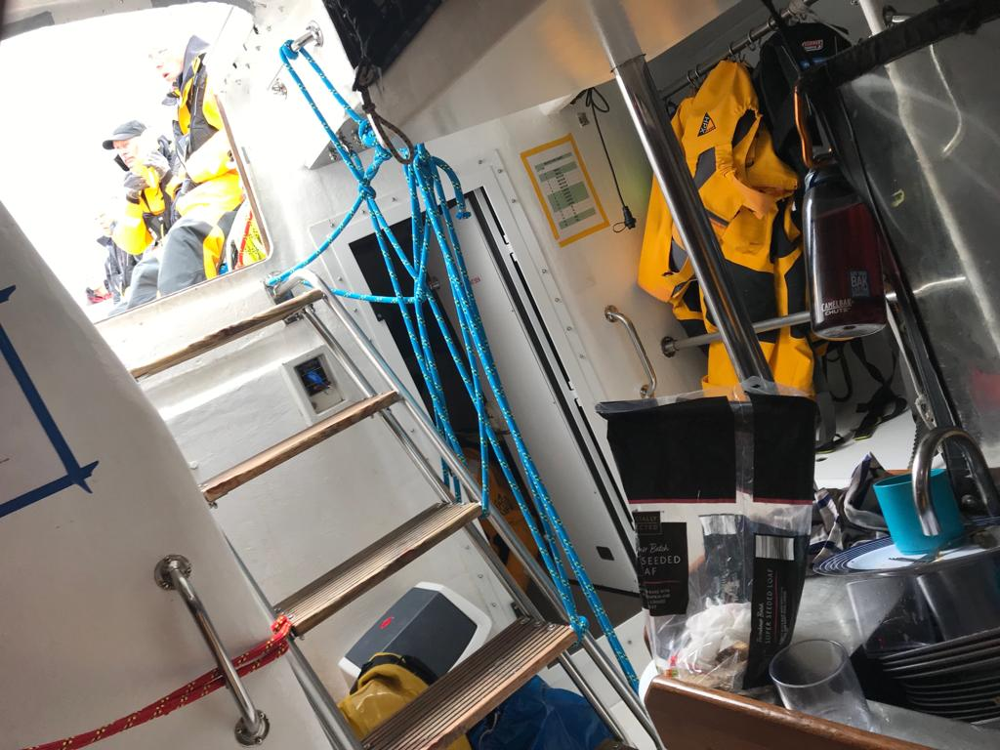
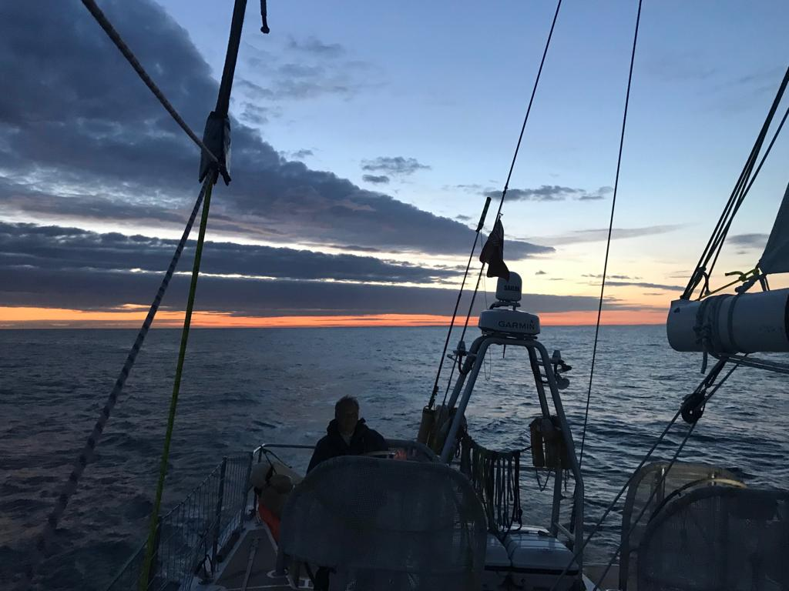

#Level Four

Level four was the first oppotunity I had to sail with my skipper and mate on the team UNICEF boat. this week was to give us a chance to get to know the boat and each other while also giving us our first tast of raceing.

This week turned out to be the hardest weeek of training for me, both physicaly and mentally. I was with fourteen of my fellow crew mates, our skipper Ian Wiggin and the mate Mike Miller.

The week started with the now standard boat prep and safety breifing before we headed out in to the sloent were we paried up with Sanya to go through boat to boat transfers and towing. 

---

---

---

We stayed at anchor over night and got our last mostly full nights sleep. The next morning we went over moving a casulaty around the boat on a spinal board. no easy on a flat boat! i'm hoping we never have to use it for real.

 
---

We then set out across the channel spinicker flying for our first test as a crew.

. 
---

After a long day running through sail hoists and reafing drills along with several MOB practices we were split into 2 watches for the night, on a 4 hour rotation from 18.00 till 10.00. Thursday morning found us enjoying the sunshine off the cost near Caen spotting dolohins.

---

The journy back from the french cost turned out to be a ruff one with 30 plus Knots of wind and moderat seas. My watch had the pleasure of packing the code 3 spiniker back into it's bag. que see sickness, trying to pack the sail in the bow of the boat while its being bounceed two meters up and down compinded with the hot stuffy nature of the space with verry little air flow put a coulpe of us over the edge, racing to get back up on deck before being over come 

---

The final part of the week consisted of practice race starts and then 2 races one of around 160nm, and one of 60nm. Friday morning saw all the boats getting ready for the races hoisting the storm sails and porading in front of the race commity boat.

---

We practiced the two start types that will be used to start the races. The first is a traditinal line start, the second is known as a Le Mans start. This is where all the boats line up on a given heading and travel at a set speed under motor for 10 minutes. All the crew have to be behind the main winches in the middle of the cockpit. After 9 minutes the engins are turned off then when the countdown reaches zero everyone rushes forward in a race to hoist the head sails. After another 10 minutes holding the course the boats are free to do as they wish. Having compleated the practice Le Mans start we got ready for a line start. It was a tigntly fought race across the line seeing us getting being only a couple of meters from qingdao as they forced us to give way. After the spray had settled we found our selves firmly fourth place a postiion we would maintain for the rest of the race across the channel and back to portland.

Race 2 was a down wind leg with a le mans start. from portland back to the east of the Isle of White. 

---

Some of the boats were handy capped as they had damaged their spinikers during the week and so were unable to use them. we found ourselves in a battle for 3 place with Sanya managing to cross the finish bearly 5 mins in frount.

In all it was a very good week with some memorabale moments. some bad like when we droped one of the spinikers to fast and subscequencly in to the sea meaning we ended up hauling a good porton of the sea up with it back on to deck. And some good like helming the boat right on the edge of its capablits during the race, because the wind took much longer to lighten than we expected. we ended up being over powered as we had the wrong sails hoisted. This was a big hilight for me.

---
 
---
 
---
 
---
 
--- 
