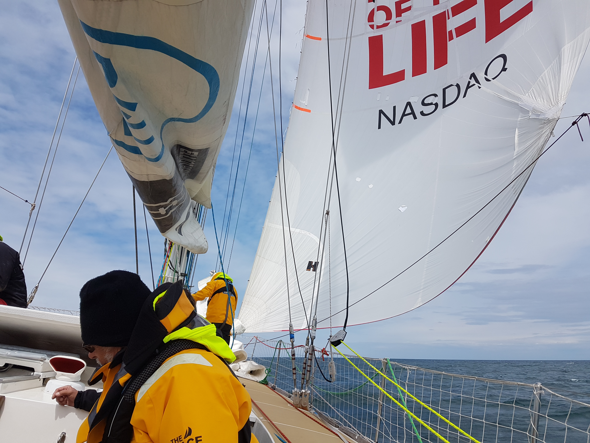
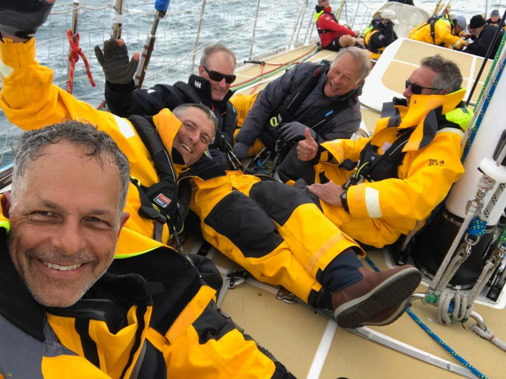
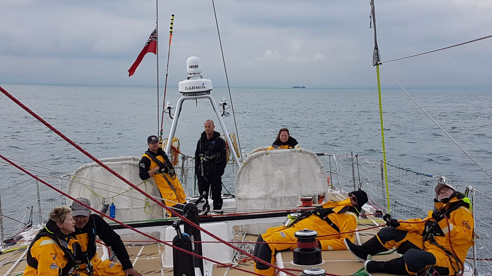

#Level Four# 

level four was the hardest weeek of training for me. I was with fourteen of my fellow crew mates, our skipper Ian Wiggin and the mate Mike Miller.
The week started with the now standard boat prep and safety breifing before we headed out in to the sloent were we paried up with Sanya to go through boat to boat transfers and towing. Mike explaning the towing setup being towed by Sanya Towing Sanya along
we stayed at anchor over night our last full nights sleep. The next morning we went over moving a casulaty around the boat on a spinal board ! no easy on a flat boat! i'm hoping we never have to use it for real. we then set out across the channel spinicker flying for our first test as a crew. ! . we split into 2 watches and a 4 hour rotation from 18.00 till 10.00. Thursday morning found us off the cost near Caen  spotting dolohins. The journy back from the french cost turned out to be a ruff one with 30 plus Knots of wind and moderat seas my watch had the pleasure of packing the code 3 back in to is bag. que see sickness, trying to pack the sail in the bow of the boat while its being bounceed two meters up and down put a coulpe of us over the edge, racing to get back up on deck before being over come 
The final part of the week consisted of practice race starts and then 2 races one of around 160nm. and one of 60nm. Friday morning saw all the boats getting ready of the races hoisting the storm sails  and porading infront of the race commity boat befor lining up for a Lemon stile start this is where all the boats line up on a given heading and travel at a set speed under motor for 10 minits after the time is up the engins are turned off then 1minit later everyone rushes forward to hoist the head sails and th drag race begins. after another 10 minits the boats are free to do as they wish. having compleated the practice le mon start we got ready for a more conventinal line start. it was a tigntly fort race across the line seeing us getting squeesed by quindow. after the spray had settled we found our selves in fourth place a postiion we would maintain for the rest of the race across the channel and back to portland. race 2 was a down wind leg with a le mon start.  recovering from the frantic spiniker hoist. some of the boats were handy capped as they had damaged there spinikers during the week and so were unable to use them. after a hard fought battle we pulled across the line in 3rd place bearly 5 mins in frount of sanya. in all it was a very good week with some memeral moments made dropping a spiniker to fast so we ended up hoisting a good porton of the sea with it being one. helming the boat right on the edge of its capablits during the race because the wind took much longer to lighten than we expected so we had the wrong sails hoisted was a big hilight for me 
 the companion way rigged for life at 45 deg.
 Chilling on the fordeck
 enjoying the light breeze under spiniker
 sun set in the chanel
 
