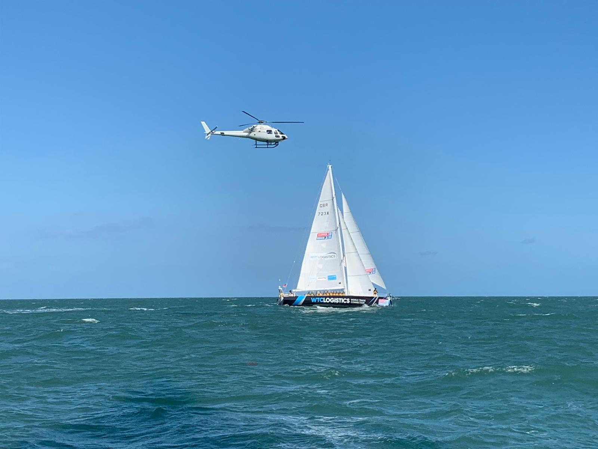
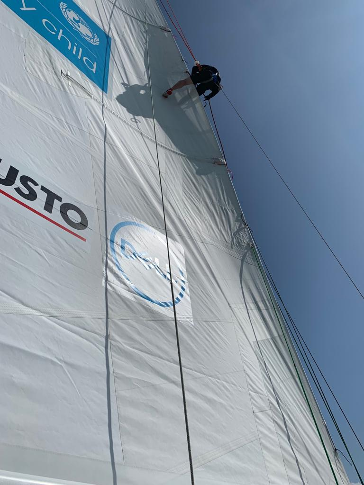
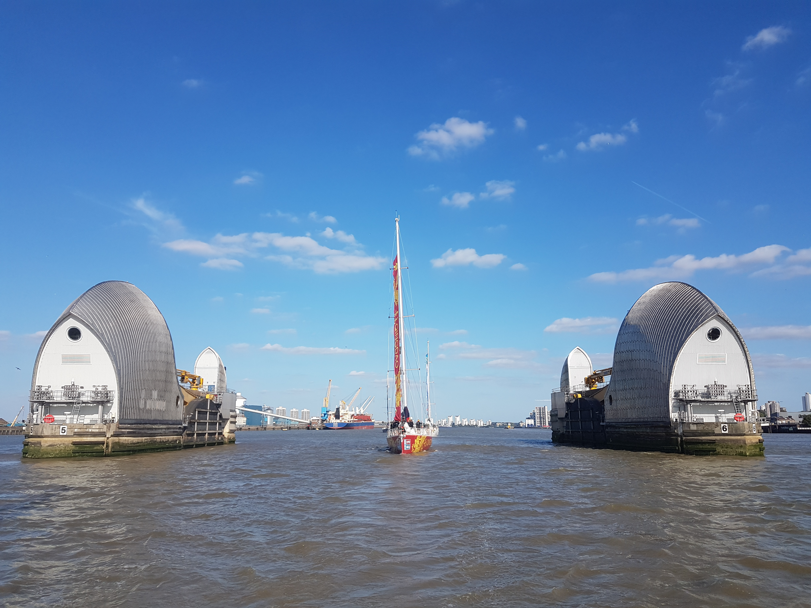
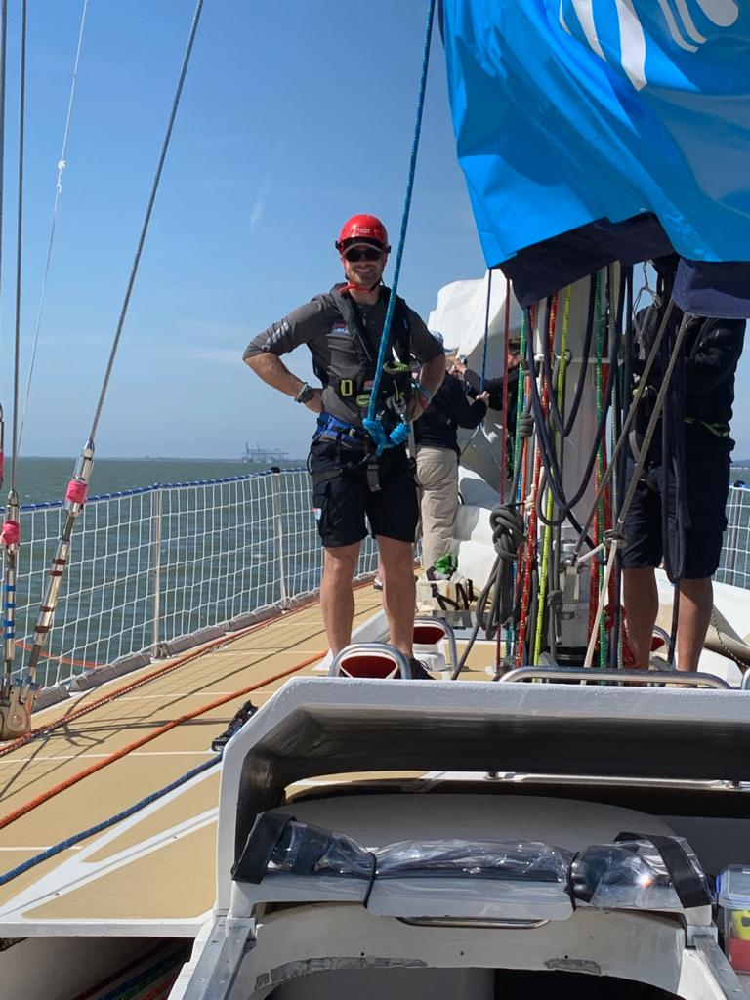
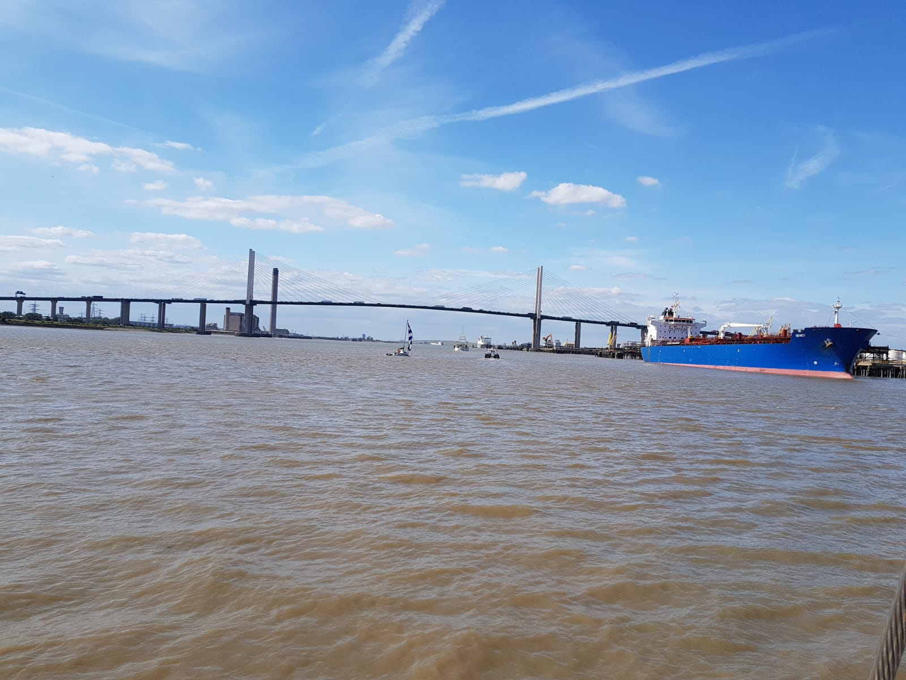
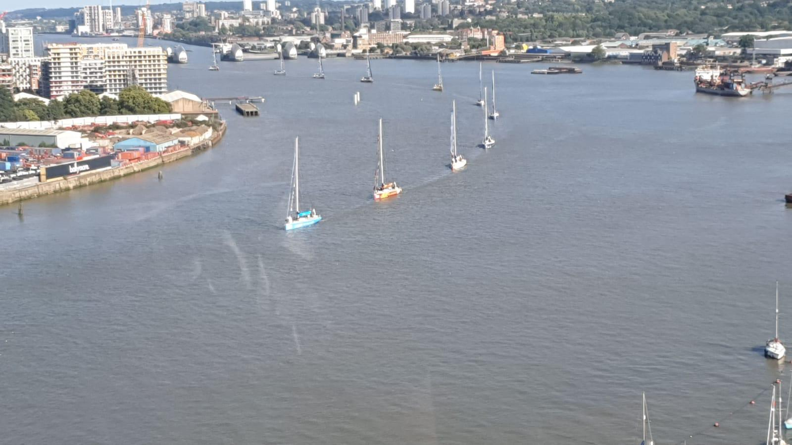
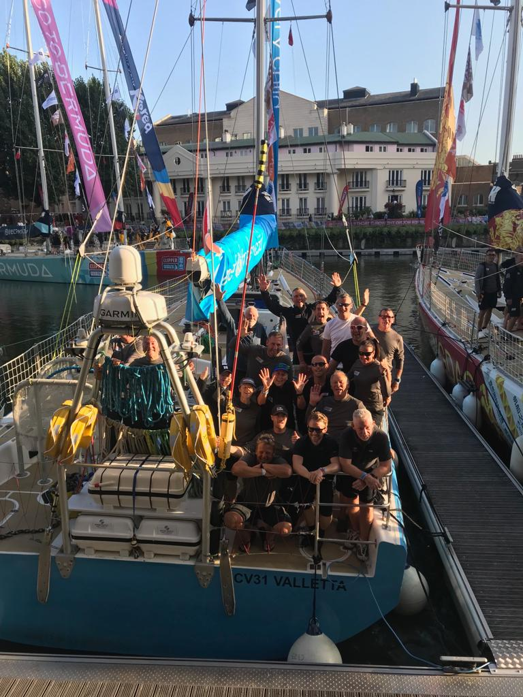
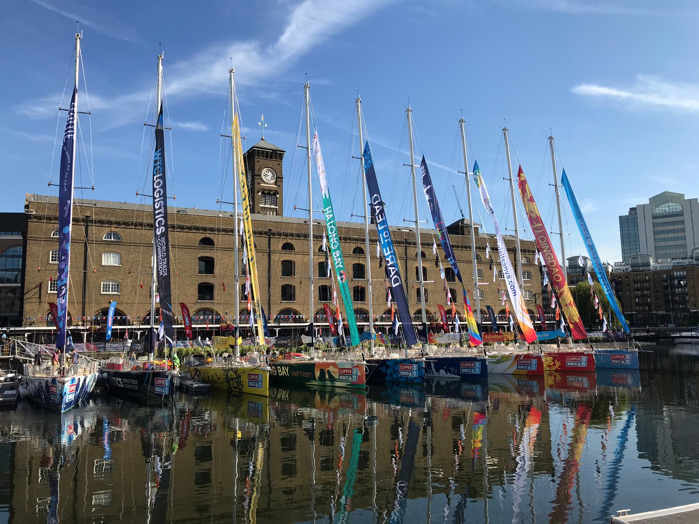

And so it starts.... Almost, first we have to get the boats to London.
After getting the boat ready and making sure everything is stored safely we set sail. Doing a practice timed departure to leave the marina. Hoisting the new main sail for the first time and checking we had run all the new lines correctly. We realised that the reef 3 line was incorrectly lead through the sail so I was sent up to rerun the line. Before we could head towords London we had to take part in a fleet formation photo shoot involving a helicopter. 

Seeing the whole fleet of 11 boats saying in formation for the first time was a memorable experience. We then set our sights on London. This would be my first voyage where I would have to  “Hot bunk” sharing my bunk with a member of the other watch. 
We had a nice sail before the wind dropped and eventualy completely dispersing. So the engine was started and we motored from around Dover untill we got to Southend to anchor for the night. We took the opportunity while motoring to do some reefing practice and I was sent up the mast to tie a line between the reefing points to make it easer to pull the sail down in high winds.

Thursday morning was spent cleaning and tidying ready for the parade up the themes  we had the privilege of being the lead boat with all the others lining up behind. Coming in to London gave a small sense of what its going to be like when we leave with lots more supporters and people cheering us on.  

