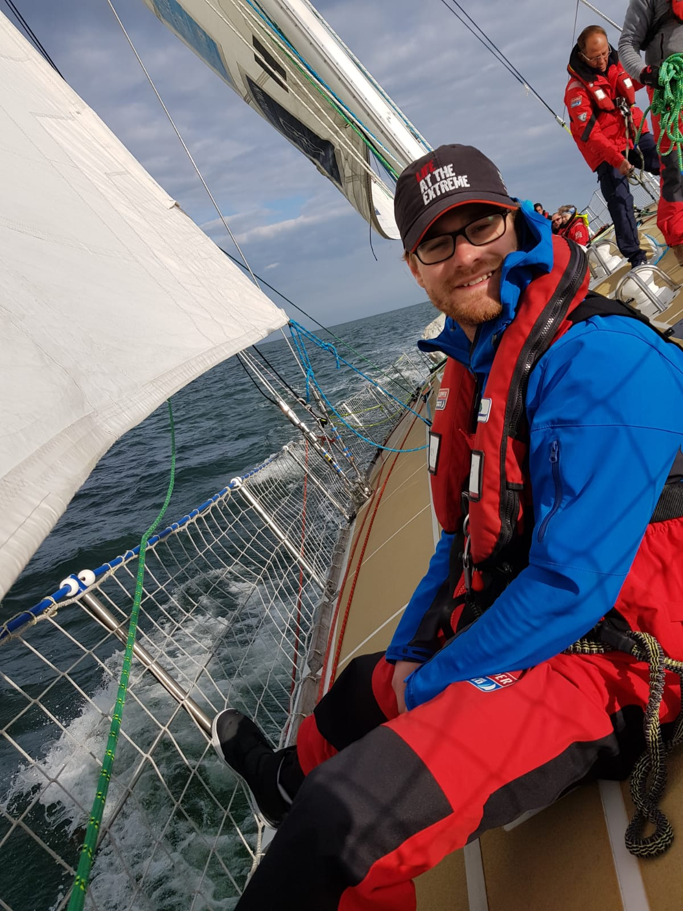

#Level Three# 

Level three we the first week of training to take place on the Clipper 70’s the boats we will be using for the race. It was also the first time we got to fly spinnakers. 
Day one consisted of an in house clipper safety update that turned out to be a death by power point with some very interesting story’s thrown in as the instructor was a skipper on the Liverpool boat from the previous race.  
Then it was down to the marina to meet our skipper and mate for the week. I was fortunate to have two race skippers as the skipper and mate. Before starting the increasingly familiar boat walk through and briefings.
As this was a week to get to learn the 70’s and teach us the use of spinnakers we stayed on port each night. Light winds and sunshine where the order of the week. Providing us with a good opportunity to familiarise ourselves with the boats without having to contend with the weather. This did mean that we spend one evening motoring east to Portland so we could catch the wind back the next day and have a full day flying the spinnakers. Doing downwind MOB drills and getting a feel for the boats. 

