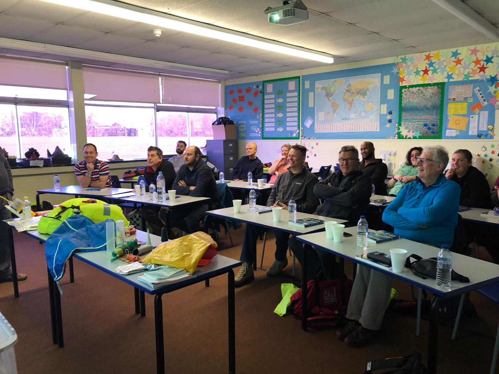
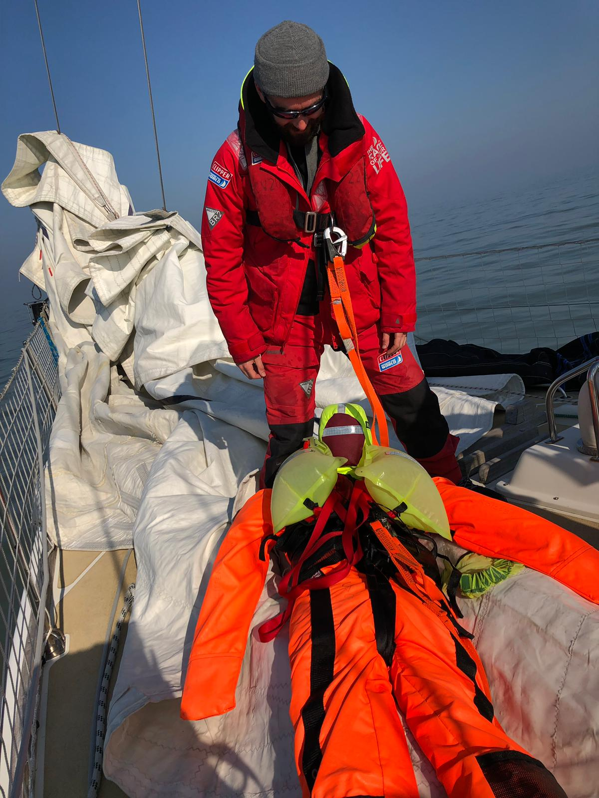
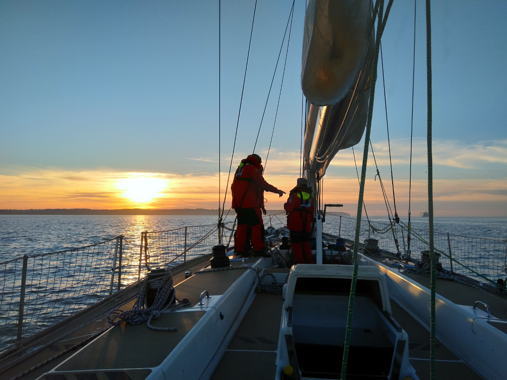

#Level Two#

##sea survival##

The first day of my level two training started off at a local school were we spent the morning in the class room learning sea survival theory before we headed to the pool for a practical session using a life raft. 

---
##The Week on the Boat##

I had picked February for my training week in the hopes that it would provide me with a good idea what is will be like living on board in bad weather. The British weather had other plans, I ended up being out on the boat during one of the hottest weeks in February. We had sunshine and light winds all week. Although this didn’t give me the opportunity to test kit that I was looking for it did mean that we could spend lots of time going over boat evolutions. Reefing and un-reefing the main sail, hoisting and changing the head sails, MOB’s and more. 

Before we left Gosport we went through a dry MOB drill to make sure we were clear on what to do. 

---
Then we needed to fill up the fuel tanks as they had been left virtually empty by the previous users 40mins later we were ready to set sail.

---

This week we spent the nights at anchor running a one hour watch rotation to make sure we were not drifting. One of the other boats managed to lose their anchor in the middle of the night proving how important the watch was. 
As with week one we weren’t free from mechanical issues with the starter motor getting stuck on. The only way we could stop it was to completely isolate the electronics in the engine compartment. The problem with this was that it also turned off the automatic fire extinguisher and the other warning censers. A trip back to Gosport was required so the maintenance team could changed a small relay that was causing all the problems.  

While we were sailing round the isle of white we heard a mayday from one of the other clipper boats stating that they were on fire and required assistance. We determined that we were too far from them to help but listened in with interest to hear of any developments. Shortly after the coastguard put out an information broadcast telling everyone to stand down as it was a false alarm. It turned out that while running through a drill one of the crew had sent out a real message rather than pretending to issue one. 

The final day of the week means deep clean. This involves removing everything from below decks washing all the ropes empting and cleaning the bulges scrubbing the floor panels. Then putting it all back in the correct place it becomes a giant jigsaw as each piece is different and has a specific location to go back in to.  Once the clean is finished then it’s of the local caff for a well-deserved lunch before heading home 

---

 

