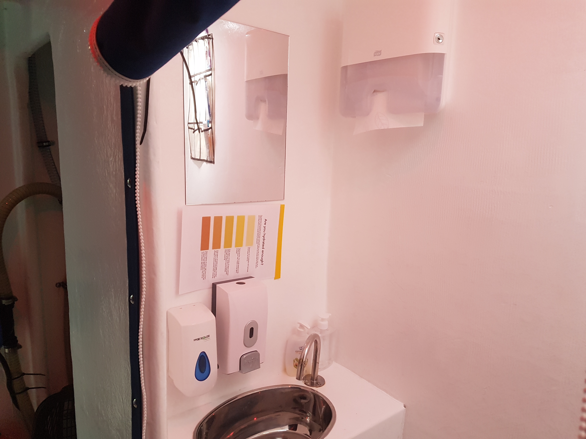
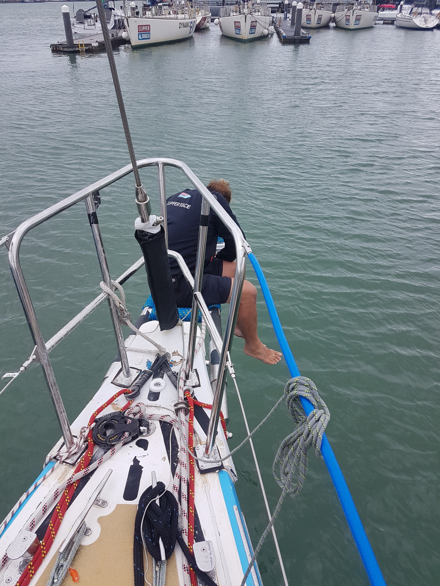

[Big Blue Boat Prep Week Video](https://www.facebook.com/TheBigBlueClipperBoat/videos/2084700251836059/)

Before leaving the UK for the race the boats need to be prepared. We are given a week to prepare our boat for the race. 
The week started on Saturday with a lunch time briefing, going over the main jobs that needed to be done and listing some of the dream jobs that would be nice to complete if there was time. The list was long and daunting to start. Including changing the sails for new ones, changing all the running rigging on the boat (ropes) putting new netting on the guard rails. And that's just above decks!! After the briefing we spilt into groups to start working through the jobs. As the designated ships engineer my first task was to do an inventory of the tools and spares on board work out what was and wasn't needed and pack them into the allocated storage space

Sunday and Monday were going through the jobs list and working out what we required from stores to complete them. Taking the old sails to the skip and collecting the shiny new ones checking them over for damage. And staring the jobs we had the stuff for like fixing the fridge in place.

Tuesday I spent all day in the lazarett which is the compartment at the back of the boat which contains the steering and is also used to store the rubbish, emergency water and diesel. Putting up netting to prevent anything being stored from getting to the steering cable areas and causing problems. During the day a freshly made cup of tea that I had left on deck was knocked over while I was down the hatch, landing all over my shoulder and back. So I spent 15mins sat on the pontoon using a hose to get cold water on to my back. 

Wednesday was rope replacement day and wrapping the bowsprit with blue rope to provide extra grip.

Thursday we took a group trip to the park with the spinnakers to check those and pack them in to the bags. It's amazing how big the sails are when you have them laid out on the ground. I also spent time putting an extra sheath on the ends of the ropes to provide some extra chafe protection. 

Friday the final sprint to finish the main jobs. Putting the soap dispensers and paper towel holders in the heads, fixing the mirror for those using contacts and the white board for our briefings 

The week went by very quickly by the end we had complete all the major jobs and most of the minor ones leaving a selection of dream jobs as on going projects. As a team we had a really good turn out and it was a great opportunity to get to know my fellow crew members better in a much more relaxed environment to the previous weeks of training.   

