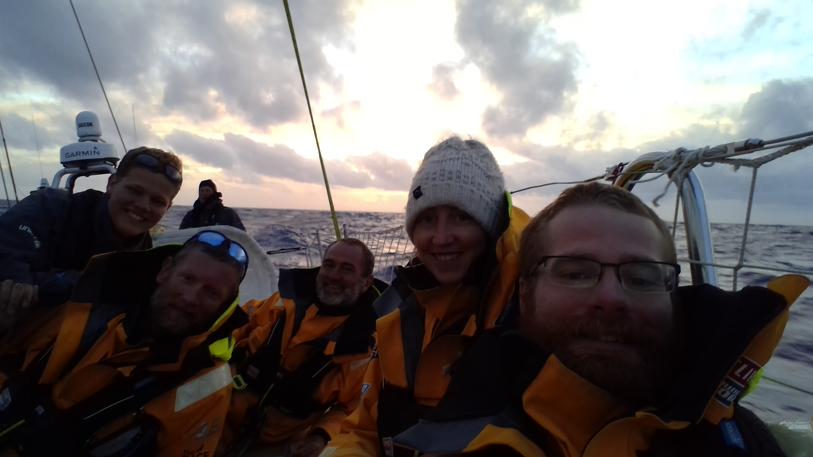

# Race 4 cape town to Fremantle.

## Mon 18th November

For race start we now use a pre selected team on the winches so Ian knows what to expect from our manoeuvrers this allows him to focus on keeping us safe and competitive. During that initial scuffle across the line and around the first of the course marks we ended up in a position close to Qingdao the decision was made to tack away sacrificing our position in the fleet for more room this meant that we left the bay in the back end of the pace however Sanya and Punta del Este where involved in a collision and now will be stuck in cape town while repairs are made. 

The first 24 hours of the race we were beating up wind to get past the cape this resulted in 4 of my watch getting sea sick as we pounded through the waves. Now the wind has shifted allowing us to flatten out the boat and set our sites on Fremantle some 4000 miles distant. 

## Thursday 21st

We have enjoyed 3 days of sunny sailing with winds of around 20 knots up to 35 at times. Today everyone finally got over their sea sickness. We have sustained our first injury of the leg Thomas got lifted by a wave crashing over the boat and cartwheeled across the cockpit smashing his face on the way across knocking out some of his teeth. We are currently enjoying the benefit of a favourable current giving us a speed boost on our way to Fremantle. The days are quickly passing by at the moment as we bring the new leggers up to speed on living on the boat.
 
## Friday 22nd

During our first watch of the night the wind died down as predicted so we shook out the 2 reefs in the main hoisted the stay sail and made the most of the shift that came pointing the boat back towards cape town.

The second watch between 3 and 7 was a hard one with no references and half my watch out of action. One from his fall earlier in the day. One from suspected appendicitis one who was administering aide. The normal one to mother duties making the deck feel very empty especially when people headed down below decks to do their jobs of cleaning the bilges and heads along with righting the log. Every one pulled together as we retrimmed the sails multiple times to adjust of the changes in wind and keep us heading in the right direction at speed. When it got light we realised why the staysail hoist had been so hard the watch before as we had managed to hoist the yanky sheet up with the stay sail having left it hooked over the top hanks. An easy thing to spot in the light but hard to notice in the darkness.

## Sat 23rd 

We suspended racing yesterday at 10.30 boat time 7.30 UTC and turned towards Derbon on the south African cost. To facilitate the medivac of Andy. This is around a 600mile trip to the north something that we think will take around 3 days. We will be making best speed which means that we will motor or sail depending on which is quicker.

Just after dinner at 20.00 boat time Sandra got whipped by the active spinnaker sheet while attaching the shackle for the tweaker we use to prevent the sheet from chafing on the boom. This resulted in her sustaining bruising to her left thumb and getting a big cut on the back of her hand in a crescent shape exposing the tendon beneath. She required 4 stitches administered by holly in the galley come surgery. Getting her off the deck and down onto the galley bench was a challenge and required 4 of us to achieve. Watching holly work was a masterclass in stitching. Apparently unfazed by the rolling of the boat. While I held Sandra hand in place. During the 22 till 3 watch we dropped the spinnaker and started the engine as the wind dropped before dyeing out completely. Coming on deck after breakfast the sun is shining and the sea is calm giving me a much needed chance to try and catch up on some rest and up date this record. 

I'm receiving spelling instructions from our French crew member Sandra :)

## Monday 25th

we are currently enjoying calm seas and fair winds keeping us on course for Durbon to drop off Andy using the motor only when our speed drops below 6 knots over the ground to conserve fuel for the coming weeks also sailing is often much faster than using the engine. Tomorrow me and Alex will do our first mother since race3 days out from London on race 1. this is to cover for Sandra and Andy who are both excused duties on medical grounds. 

## Wed 27th 

yesterday Alex and I took up station in the galley as mothers for the first time since race one replacing Sandra and Andy as they re both banned from duties. Accompanied by lots of heckling over the reason we were excused from the duties in the first place. We had an nice flat boat to work in as the seas where flat and we where motoring along on the final approach to Durban. We arrived in the port under escort by the national sea rescue centre south Africa version of the RNLI. Finally getting in at 23.30 UTC just after we had finished cleaning up after dinner. We were then given the privilege of using the rescue centres facilities to grab a shower and have a look round there boat wile we in turn gave them a tour round ours. 2H later and two crew members down (Andy and Thomas) after a resupply of fuel and loading up with 10 more days for food kindly delivered by rob a member of Korea’s crew from leg 1. we departed. And I got my first full nights sleep since leaving cape town. This morning we are back racing to Australia with the aim of getting there as quickly as possible to give us some time to enjoy the port before the next race. The back of the fleet are around 1000 miles in front and Sanya plus Punta del Este are about that behind. The during our lunch time meeting we had a reshuffle of the job rota as cef watch had lost 2 of its members so rob who is one of the mothers will be changing watch tomorrow when he comes back on. This also requires a re-jig of the job rota. Following the success of our mother watch Alex and I have been reintroduce to mothering going forward, all be it with different partners. 

## Sat 30th 

the past couple of days have been frustrating as we drifted through a wind hole only managing 5miles in a 6 hour period on the Wednesday night. Thursday thankful,y the wind picked up giving us some lovely clear sky sailing our last chance to rest and enjoy the flat sea, cloudless sky before we start to enter the type of weather that the rest of the fleet is currently experiencing reading some of the skipper blogs gives us a sense of what we are going to encounter over the coming weeks. 
After our lunch time meeting yesterday we dropped the y 1 and packed it away  potentially for the final time this leg we now need to get back on our reefing game as its going to be the most used  evolution starting last night when we put in reef 2 and shook our reef 2 on our first watch of the night and then put it back in during our 2nd watch. With squalls forecast in the coming days we will be getting loads of practice. 
The reef 2 shake out was the first one we have done with our either  Ian or mike on deck.  Another milestone and example of how much we have developed over the passed legs.

## Sunday 1st December

last night during our watch we passed through a lighting storm with the skyline up periodically with bright flashes. This continued for about a hour before moving off in front of us. Because  of the storm we put reef 2 in straight after coming on deck making the boat easy to handle despite the 25 to 30kns of wind. Today is the first day of advent to the excitement of some crew who took the opportunity to start playing there Christmas play lists and decorate the boat for the festive period.  

## Monday 2nd 

today is the calm before the storm we have spent the last night drifting at a slow phase through another wind hole we get ready for the big weather system to catch us up getting ready for a couple of seeks of wet and windy conditions. we are hope full that this will carry us at z fast pace most of the way to Fremantle currently 3300 miles away. 

## Tuesday 3rd

today I was a mother as I have said before this is a day spent below decks in the galley cooking for the rest of the crew. Its a long day starting at 5.30 and ending when you have finished cleaning up after dinner around 8.30 if all goes well but some times later. The day starts with breakfast of porridge and bread baked by the mothers the day before then lunch a soup of some kind (tomato and lentil ) accompanied by a wrap or a roll today as we are starting to run out of wraps we just added the corned beef to the soup and made some coleslaw to go with it. Then its on to dinner (chicken curry and rice) with desert freshly baked cake and tinned front. Some where in the day you also bake the bread for the next day and clean you allotted cupboards. The bonus for this hard days work is a full nights sleep from when you finish until breakfast at 6 the next day. I have to say I find the day a pleasant break from being on deck. Serving as a reminder that I can spend time of the deck during watches and the crew will keep everything running smoothly.

## Thurs 5th

we were expecting a big weather system to catch us up today leading us to have a conservative sail plan over night as there where no stars to us as reference but this this morning when we got up for breakfast we were greeted by blue sky's and 20 knts of wind this led to a pleasant morning sailing with a good westerly breeze unfortunately we want to go east so the wind direction is nit ideal but we work with what we have as the days go by we get better and better wt putting in and shaking out reefs just before our watch change over we changed from the yanky 3 to the 2 then shook out reef 1 to try and mike the most of the winds. 

We have now travelled around 3500 since Cape town and have added another to our collection of wounded this leg as Mikey got knocked by a wave into a winch and bruised/broke his ribs. He is now excused all duties to recover.

Most people are asking about the big weather as this is why the signed up for this leg not the sunny calm sees we have mainly had so far..

## Friday 6th

the swell has increased over night along with the breeze gusting up to 30knots at times we are now heading north east as the weather has closed in the number of capable helms has decreased making the night watches a little bit more tiring for those left. Sprites are high as we speed towards our goal although some of the crew are disappointed not to be getting the full “southern ocean” experience. 

## Sat 7th

last night just after our watch change the code 3 ripped down the middle causing us to have to rush and drop it before any more damage could be done. We then proceeded under full main only through out the night this morning after the squalls had died down we hoisted the code 2the see state making the the helming very challenging so Ian spent most or the watch helming with me doing s short stretch so he could send the bog the wind and swell are forecast to die down as the day progresses which should allow Ian and mike some rest. holly Sandra and Mikey have spent there morning making a start on the repairs to the code 3 which would be a much nicer sail for these conditions  however its estimated to take two days to finish the repairs. 

## Sunday 8th

we are now closer to Fremantle than cape town three weeks in to our voyage. As seams to happen in  week three of peoples spirits where at s low point last week with worries on when we will arrive and how short our stopover will be. Combined with the lack of personal space and the knowledge that we have still got over 2000 miles to go shortening peoples patience. Holly and her helpers from the recovery ward have smashed out the spinnaker repairs having finished all the taping and now ready to stitch this means that they will take over the galley tonight turning it in to a temporary sail loft. To day we have had some pleasant beam reaching under the y1 with a cloudy sky and genital swell. 

## Monday 9th

last night was a long night getting the galley set up after an early dinner ready for the stitching. Holly and Sandra and JD spent 6h stitching with the rest of the watches rotating in line with the normal watch rotation only having 2 on deck keeping the boat moving on a beam reach under white sails in the 12knts of wind. This morning the work continues as part of the damage is in the thicker reinforced area which is to tuff for the sowing machine to handle. So today the drill is out to facilitate hand stitching of the final section. While we sail under sunny skys with the code 1 flying.  

## Wed 11th

Tuesday the expected weather caught up with us bringing rain with it. Since then we have been sailing in the rain with the y 2 up putting reefs in ant taking them out as required. This morning the wind shifted from the north to the west and the  died out completely. During a jibe the running back stay cot caught round the 2nd spreader bending it back as it was loaded. This was spotted after the jibe was completed. Ian went up to check for permanent damage after we had untangled the runner. At this time I’m not sure what damage has been done to the rigging. Although the wind has gone the rain continues.

## Thursday 12th

Today was my turn to be mother again. Thanks to a wind hole the boat was nice and flat for moat of the day our added challenge though was due to the length of time we have been at see we are now on day bag 26 and over our original hope for arrival in Fremantle this means that the bag contained half the ingredients that it was supposed to and most of the fresh produce had run our or gone off so we searched though the stash of left over ingredients from previous days to cobble together a suitable meal. Along with doing breakfast lunch  and dinner we also baked a gluten free cake for Ian. Some cake for desert and 2 loafs of bread for breakfast the next day. Then Aeser decided to make some cinnamon buns as an experiment. We will see how they turn out tomorrow. In other happenings we are now motoring to make best speed to Fremantle as the last of the fleet in front of us arrived today leaving us Punta and Sanya left to arrive. The other 2 boats have approximately 500 more miles to Fremantle than us currently although they are further south and have different wind conditions due to our diversion. Now for a full nights sleep.

## SAT 14th 

yesterday afternoon the other watch dropped the drifter buoy off. Setting it up for its 3 year journey travelling on the ocean currents sending weather dater back to NOAH where it will be used to help improve forecasting. Last night we had the code 3 up in light winds trying to maintain as direct a course to Fremantle as possible. We got to see a fantastic red/orange moon rise then had the rest of the watch illuminated by an incredibly bright full moon. During their drop of the code 3 the other watch lost one of the spinnaker sheets over the side these sheets a the most expensive on boat as they take the most loading and they have a high friction resistance .This morning we were treated to another nice sunrise as we have travelled they have gradually gotten longer giving more time to enjoy the wonderful colours. Now on our afternoon watch and its raining again. To day is kiwis birthday the first of 3 that were all supposed to be in port. Tomorrow is mine and mike our AQP is the day after.
This afternoon we where hit by a squall that increased the wind speed by 10knots a quick reef was required. What followed was one of the quickest and best reefing evolutions we have done so far. Even more so because we hadn't spent any time talking it through and went from sitting around chatting to action stations quickly and calmly. 

## Tues 17th

Sunday was my birthday. Sophie and Sandra had the dubious  pleasure of being mothers to give  them selves a challenge they decided to do some firsts for the boat starting with fresh hand made pizza followed by pavlova as our lunch time meal. The day was spent compiling own version of song 12 days of Christmas performed at our fun-day Sunday meeting

Monday was mike day the final of the set the sailing was quite tricky with big squalls passing all around requiring us to be on our toes ready to put reefs in and take them out as required.

Today we had another sunny day thankfully squall free although we did have to chge the head sail back to the y2 due to restrictions placed on us the race office due to damage our starboard side spreader sustained during a jibe a couple of days ago. As we get closer to Fremantle we are starting to look at getting the boat ready for port with Andrew and Geoff going through the supplys and working out what we can take into the country.  

## Thursday 19th

the wind picked up over night as expected seeing us cruising along under 3reefs and the y3 in 25 to 35knots of wind and a big swell this sail plan is less than we would normally run in the weather conditions but we have to be conservative due to the damage on the rig. We are now due to arrive tomorrow.  To the relief of some people as we will be 10 days later than we originally hoped. As the fresh food has run out the mothers have found more and more creative ways of presenting corned beef and tuna which have become the staples of our diet. 

## Friday 20th 

as predicted the wind has been slowly dyeing off over the night so we have been shaking out the reefs and finally hoisted the code 3 just after sun rise. We are now under 100 miles to go. And the day is being lent to getting the boat ready for port final sorting of the small amount of food left. Cleaning as much of the boat as we can access. Just as we came off watch after breakfast the engine was turned on so as to make best speed to the finish.

