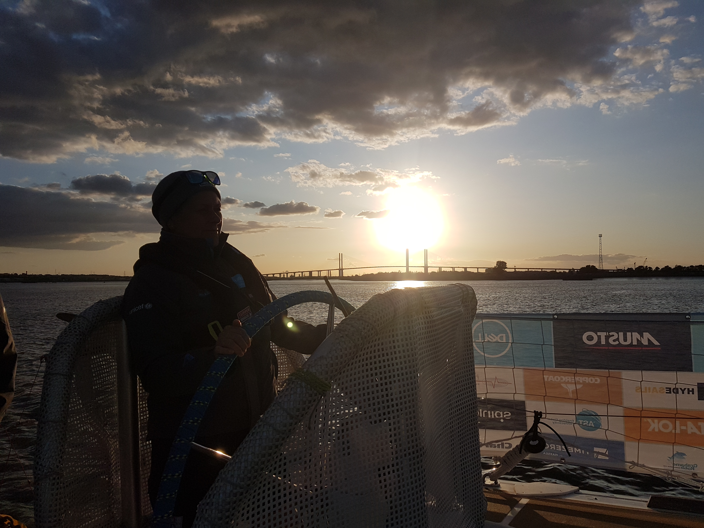

Race one London to Portimaio

Leaving London was an incredible experience with hundreds of supporters who turned out to see the boats off. As part of the ceremonies we had the privilege of passing through tower bridge. 

Race start the next morning was off the end of Southend pier. A light down wind start that saw all the boats competing for position on the southern end of the line. At times they where so close if felt like I could reach out and touch the next boat along. Each boat differed in when they decided to raise there spinnakers. We decided to hold on “white sails” longer then most as it gave us more options to manoeuvrer in the initial chaos and hold better angle on the first mark. After a morning of intense activity we settled in to our watch system under clear blue sky's and light north Westerly wind.

Thursday 5th

I have just finished my first mother watch which was a blessing and a curse at the same time. You get a full uninterrupted nights sleep but you don't get to go up on deck as every waking moment is spent preparing the next meal or cleaning up after the last one. Then you hit the bunk for a some much needed rest. I think I found it particularly hard from a combination of exhaustion and dehydration along with the motion of the boat meant that I was sick a couple of times. 

We are now crossing the bay of Biscay and have turned on to a beam reach flying the code 2 the beat up the channel was particularly punishing for all with the low side rail frequently under the water and the steep angle combined with pounding through the waves making moving around below decks especially challenging. We are currently in 3rd place close to the lead boats heading for the scoring gate.

Friday 6th 

Everyone was in high sprites on Thursday afternoon now that the boat wast at such a steep angle the mother watch of Sandra and Danny where the first to have enough energy to bake some very delicious cup cakes.

last night saw us drop the code 2 and hoist the Yanky 2 on the 2300 watch change. We are now running with a full main and the y2. Getting woken up by being told to get ready to receive the dropped kite meant we all assembled in various states of dress.  After the sail change the winds picked up.  Helming in the dark in 3m swell with 20 kn of wind was a challenge although I found it better as you had to go completely by the feel of the boat with minimal visual clews. During the night it was announced we where in 1st place as the lead boats had decided to go for the bonus gate. Costing them the virtual lead. While on the morning watch we saw wins of up tp 35 kn an we executed a couple of jibes to get us out of the bay and clear of the virtual race mark.

Sat 7th am

my watch got called on deck 1 hour early last night just before dinner as we needed the weight to trim the boat in the high winds (approx 44kn) and 4m swell. We had had a couple of very close calls on broaching and this made a huge difference to the boat handling. After 2 hours we started to rotate people 2 at a time below to worm up and have some dinner. Once the wind dropped to a more respectable speed  the off watch was allowed to stop huddling like penguins and go and get some sleep. We agreed that they would come back on watch an1 hour later than normal to give them some more rest although this still meant that they only got an hours. The winds finally started do drop down even further as the night wore on. After a short 3 hour rest we come back on watch. As the sun started to rise the wind continued to drop so we hoisted the code 2 much to the relief of the off watch who were not looking forward to hoisting it on the short amount of rest that they got last night. As is becoming standard the mothers defied the difficult conditions and delayed eating time to provide us with a much needed dinner and snacks late into the night 

Sunday 8th 

As we rounded the bottom of Portugal it was looking good for us to be getting a podium finish and everyone was in high sprites as we chased down Qingdao in the slowly dyeing winds. After a long game of chase we where finally in touching distance of the lead. Our hopes where dashed when we saw Punta Del esta and the rest of the middle pack using the coastal winds to speed straight passed. We finally managed To make it into Portomaio after a gruelling 24 hours where we only made 20 miles a distance that we were doing in less than an hour at some points in the race.  We where gutted to be coming in 6th  and extremely tired from the 5.30 am finish. Being so close the finish for so long no one was able to rest properly. The general feeling is that we sailed well and were unlucky with the weather on the final day of sailing. Which I feel puts us in a good place going forward in to the next race as we have proved that we are a serious threat in the general standings. 

