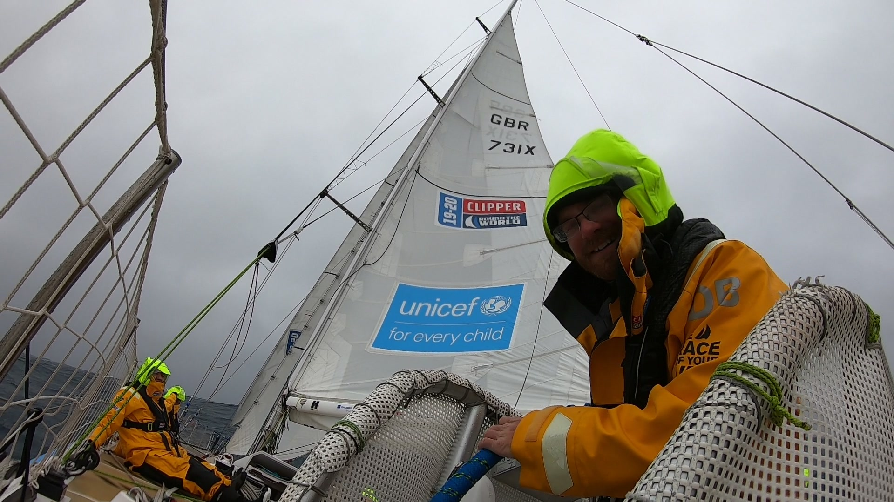
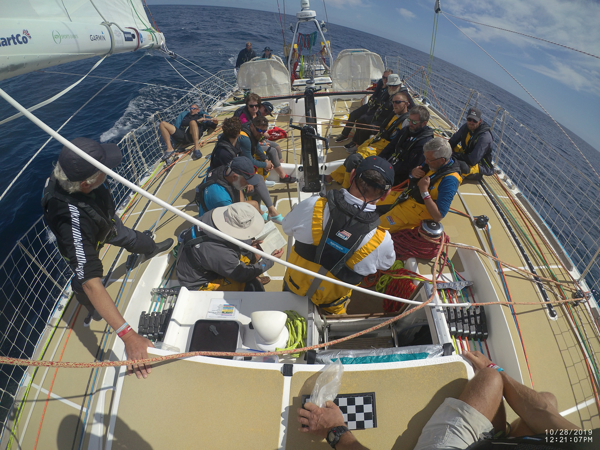
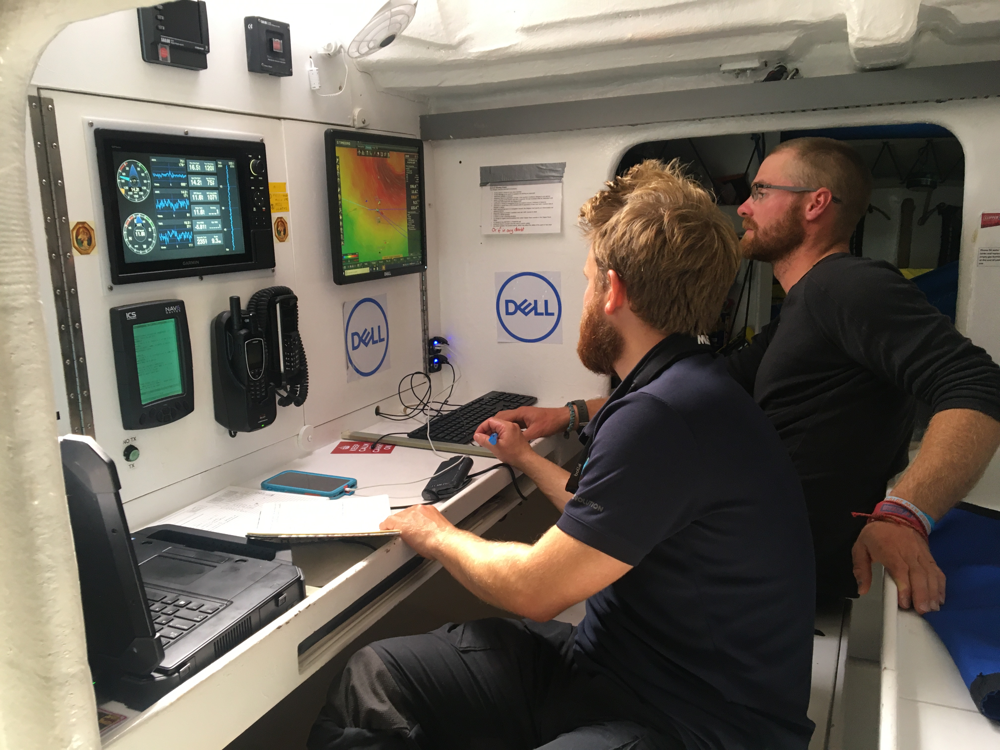
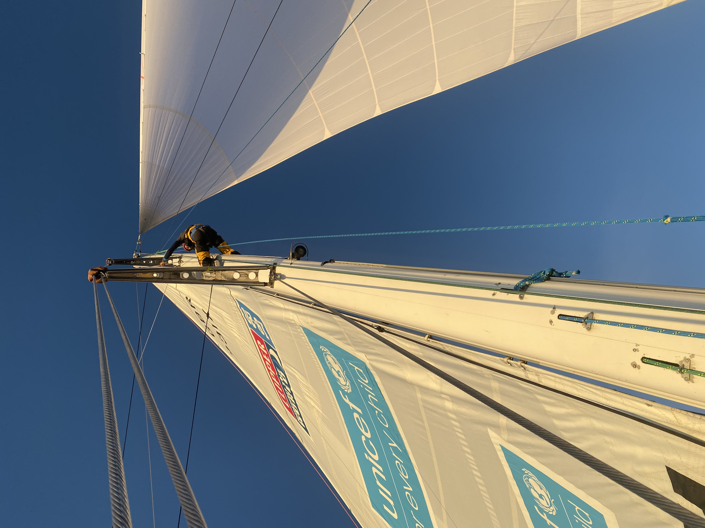
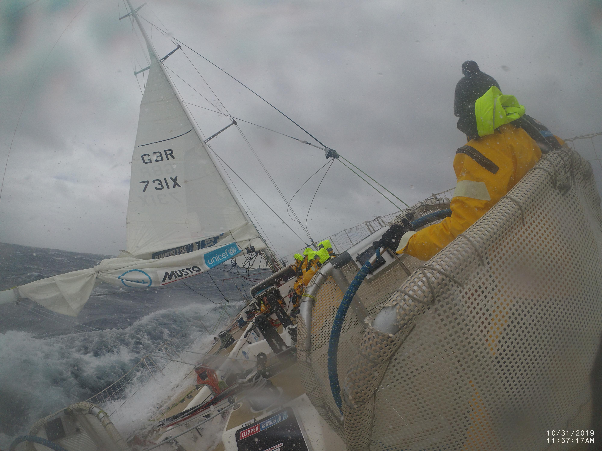

# Leg 2 Punta del Este to Cape Town

## Fri 25th

race start was Wednesday at 1500 local time, we had a good start with the pick of the crew manning the winches for the initial course switching into the watch system after we had cleared the last insure mark and headed east for cape town. So far life is quickly slipping back into the routine of boat life however the first 2 days have been tuff getting back into the sleeping patterns and job rotas. Although the weather has been mostly sunny with 25 knots of wind. We have had some short and steep swells that have incapacitated a couple of the new crew with sea sickness messing up the mother rota and requiring other to jump in and fill the space to make sure everyone if fed. We currently have been flying the code 3 spinnaker leaving the cost. Have been in with the lead pack of boats maintaining visual on the top 5. At lunch time to day it was announced that the latest update put us in first place a position we hope to defend until we get to cape town.

## Sat 26th

the small things matter. You don't realise how many small things you do that make life easer. Until your watching some one struggle and realise that you forgot to explain 3 things that o take for granted to them. Introducing the new leggers to the boat systems and jobs. Over the first tow days has been a learning curve for everyone involved. Highlighting the little things we have picked up over the past two races that weren't mentioned during training.

We had a challenging couple of watches at the helm with the code 3 up as the wind kept shifting direction be 30 or 40 deg making it imposable to use any reference on the horizon then during the night clouds covered most of the sky in-front giving us the choice of black or more black for reference. Combined with a steep and unpredictable swell it presented a challenge to keep the spinnaker flying and prevent the boat from broaching.

## Sun 27th

As the wind dropped off we hoisted the code 2 during the sat afternoon watch. It took us 8 minuets from the start of the drop to getting the new sail filled and good time for our first change as a watch this race. We are still with the same 5 boats competing with Seattle and Punta for the lead. As the morning watch dragged on the wind became ever lighter. The lunchtime meeting brought the joys of Smarties and marshmallows as john Dillon took charge of proceedings from Sophie how is not doing this leg. With the sun shining and music playing the crew are in high sprites enjoying the nice weather before the big system and strong winds which are due to come in a couple of days. The scoring gate is our next target at a round 300 miles off this marks approximately one third of the distance for this leg.

## Mon 28th

During the night we decided to split from the rest of the pack as we were not gaining on the lead boats and felt that time was right looking at the forecasts to head further north ready for when the weather system moves in. so we changed from the spinnaker back to white sails. Then the other watch changed from white sails to the code 1 as the wind continued to drop making keeping the boat moving a challenge reminding us of the light wind sailing from the first races. Hopefully the other boats are experiencing the same wind conditions. We will be unable to tell if the plan has worked as intended until the next scheduled update. Until then we can only try and enjoy the freedom of not being tethered and make the most of the good weather despite the frustrating sailing. Before we have to batten down the hatches.

## Tues 29th

yesterday afternoon Ian went up the mast to do a rig check and spotted that the main halyard had become de sheathed this resulted in an hour operation where we lashed the main to the top of the mast lowered the halyard down so we could cut the damaged section off and then reattach it back on to the mast. This morning with the new weather forecast we gave up on getting the scoring gate as we are 4 in the running by proximately 10 miles. The forecast requires us the head slightly south of east catch the favourable weather systems and avoid hitting one head on.

## Wed 30th

we had a busy night last night with a swap from the code 1 to the 3 during which took us a respectable 8 minutes 14s. Then as the weather rolled in we had a night of cloud cover giving no reference points at all. Just before the watch changeover the other watch dropped the spinnaker and 3 as the wind had continued to build finally maxing out at 66 knots. This lead to a very wet watch where water was coming over boat from# all directions at one point knocking everyone into the bottom of the cockpit. With the spray whiting out all vision as we charged down the waves.

Fri 1st November hoisted the y3 as the wind had built and come round. No we are finally experiencing the weather that this part of the world is known for after a week of blue sky spinnaker flying we are expecting a week of wet and id sailing at 30deg.

## Thurs 31st

during the afternoon watch yesterday we hoisted the Yankee 1 to allow us to keep pushing and get hopefully in the right place to catch the forecasted weather systems in the most favourable way. The night watch was hard as it was cold and incredibly dark with nothing to look at for reference. We where rushed out of bed this morning as the other watch was struggling to get the Yankee 1 away as we had received an email form dare to lead saying that they had experienced 70+ knots of wind and where sailing bare polled. Shortly after it was down the wind increased so we put reef 2 in then about 20 min later we put in reef.

Cold and wet is how the last watches have been. This morning we had a busy one. Shaking out reef 3 as soon as we came on deck then as the wind continued to die because the weather system was leaving us behind we took out reef 2 and 1 simultaneously. Finally just before breakfast we changed the yanky 3 for the yanky one. During my off watch I was woken by Alex as the elbow joint on the port primary winch had had all but 2 of the bolts holding it in place fall out and the final 2 bent with there threads shredded. So began the hunt for all the missing bolts so we could re assemble everything and get the winch back in action. During the afternoon I helped Ian trying to fix the generator as it had stopped working showing a cooling fault. We where unsuccessful in our attempt and wait a response from the maintenance team as to potential solutions. Last night just before dinner while getting dressed Sandra managed to pierce her little finger with the small carabinier on the back of her boots. Meaning that she has had to stay below decks for the past 24h to give it time to heal. Much to her frustration. Some of the crew are recovering from a refresh of there initial sea sickness from the big swell we experienced over the previous couple of days. Tomorrow we are expecting another system to catch us us and provide us with some more of the same big waves and high winds.

## Sunday 3rd

During the afternoon we had a ruff time changing the y2 for the y3 as the winds where building and predicted to get even stronger. After getting the y2 down with out any issues we struggled to the the 3 to the foredeck to be hanked on at one point the sail plus 4 of us all got lifted and moved several meters back to the aft of the boat. After an hour of struggling we achieved our goal and finally got the sail hoisted. We were all looking forward to getting our heads down for some rest at the end of the watch. After the sail change and putting a reef in the wind dropped down to 10 knots leaving us completely under powered the knowledge of the weather system moving around us kept us couscous over night as we didn't want to be caught unaware at night.

## Mon 4th

the last couple of days have been particularly tiring. With multiple sail changes in some pretty bouncy conditions. This morning we but in a reef and tacked with a skeleton crew as some where down with sea sickness and others were fixing the y2 which had 8 rips in it from catching on an unprotected spit pin on deck. Then the wind built to 40 knots and the swell increased as well helming in this was amazing with top speeds in the mid 20s knots reached while surfing down the swell getting spray from the rooster tails off the bow blown back over to boat obscuring all vision for a brief moment.

## Wed 6th

we are now in stealth for no other reason than we wanted to use it before the end of the race. Tuesday was a long day with me and mike and Ian sharing the helm during the afternoon watch in the 7m swell and 40knots of wind reaching the high fifties in the squalls. Then during our night watch the clouds covered the sky and although the wind had dropped there was no white caps on the waves to give any reference points. We where flying our stay sail and 2 reefs In the main while still doing up to 27 knots down the waves.

## Friday 7th

coming into the race finish we were catching up with Punta del Este with howling bay close behind. As we entered the bay we pass into the wind shadow of table mounting going from 25knots of wind down to 4. as we crept along we hoisted our windseaker with the knowledge that how long bay where closing in all the time and the hope that we could close on Punta. When we moved out of the shadow and in to 40knots of wind suddenly we needed to get our light wait sails down and get the boat set for the increased wind to allow us to get to the finish. With all the crew on deck the place was crowded with body's everywhere we pulled through and managed to to the longest sequence of sail changes so far dropping the wind seeker hoisting the yanky 2 realising that the boat was still over powered dropping the yanky 2 and hoisting the stay sail. And finally putting reef 2 in the main sail. Before we could try and sort out the mass of ropes pulled in the cockpit and prepare for the final couple of tacks to make it to the finish line securing our 3rd place position.

