Portomaio to Punta del Este	

Monday 16th 

After a week on shore most of the crew where ready to get back to sea. We had spent the time fixing the damage from the last race. Doing routine servicing of the winches and rebuilding the “X box” which is the splitter that allows us transfer the power from the grinders to the winches. This was sounding really noisy so we spoke to the maintenance team and together stripped it down. Finding a pile of fillings where the cogs should have been.
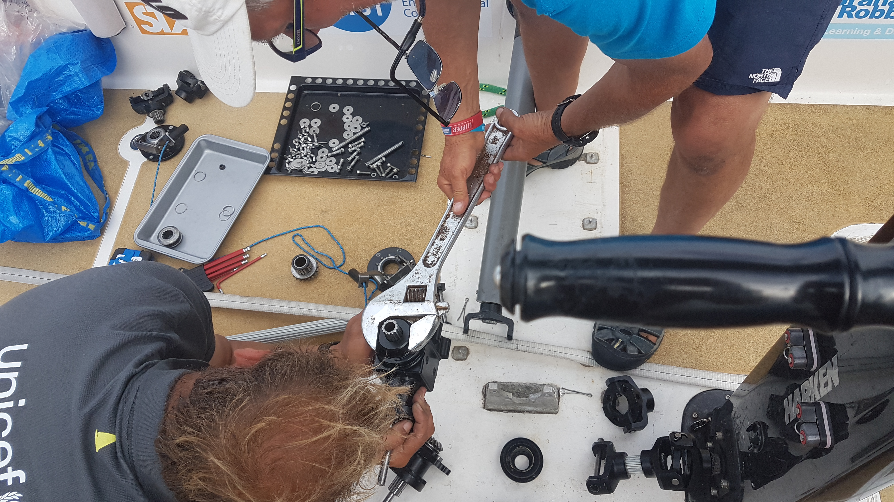

Race start was a smilier format to London with slipping lines and a short parade before heading out to the start line with a large flotilla of small craft crowding round. After a short inshore course we headed out to sea. having been conservative to avoid any collision with the other boats we were in 10th place. As the night progressed and we sailed into the predicted light winds we closed on the top of the fleet. 
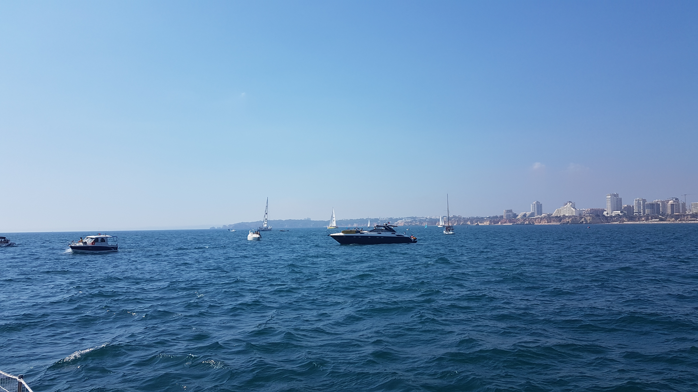

Tuesday 17th

We are now about 50 miles of the cost of Morocco sailing along in around 15kn of wind and settling into life on board. The last positional update puts is in 3rd place however this far from the finish its not a particularly good reflection of the race. During this mornings watch I spent a couple of hours coaching Ursy and Jayne on the helm helping to improve their skills and ultimately help all of us in the long run by enabling the job to be shared by more people. 

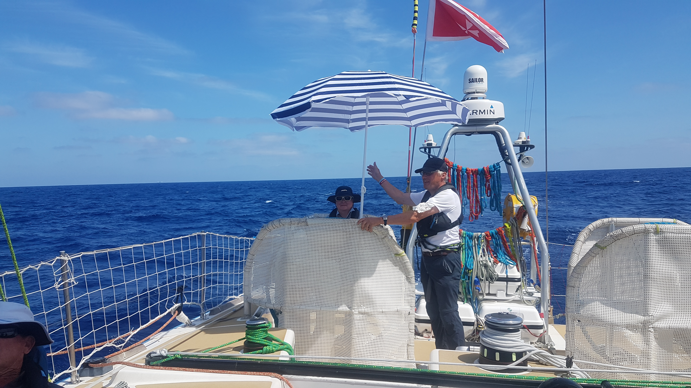
Wednesday 18th 8.00

The second half of the night proved to be an eventful one. Moving from light down wind sailing in the company of dolphins through fishing fleets of the cost of Morocco, to 25kns of wind and an in-cress in the swell.  The other watch experienced a messy jibe when one of them lost control of the new spinnaker sheet and over balanced thankfully not doing any damage to himself. They recovered well. Then at around 5.30 in the morning about 1h 30m for from the end of our watch the tack line on the spinnaker got rapped around the bow sprit and blew the snap shackle meaning that we had to leap in to action and drop the code 2 that we had been flying and hoist the code 3, as it was to windy for the code 1. pack the code 2. Drop the code 3. Re-hoist  the code 2, and finally repack the code 3, all this took us around 2 hours. As a watch we responded well with everyone falling into a role with out any direction. It almost felt like we had done this several times before whitch was great to experience and I feel has shown how far we have come as a team. 

Thursday 19th

During the night watch I failed to notice how close we where getting to a fishing trawler thankfully the other vessel was paying attention and radioed to find out what our intention was. This was picked up by Ian who had been below deck writing his blog. A lesson learned on just how quickly we close on other boats and how hard it is to judge distance at night.

This morning the other watch noticed some holes in the code 2 that they think were caused by a less than ideal jibe, where the sheet was pulled in too soon and crushed the sail onto the forestay. So after breakfast my watch dropped the spinnaker and hoisted the code 3, so Holly our sail repair expert could get to work patching the sail. With the loss of some of the watch  to help we were short handed on deck a little concerning at times, as it would have been impassable to recover from some scenarios with so little people available. I spent some time during the watch coaching John on helming before taking over and having a go myself. Ian and mike are starting to spend less time on deck during the watches. A good sign I believe as it shows that they are starting to trust  our skills and judgment in keeping the boat safe and on course. 

Friday 20th

Last night the day treated us to another beautiful sunset just before dinner. Our vittuler Angie has done an incredible job with the food menu on board. We are almost at the end of the fourteen day rotation and so far everything has been well prepared by the days cooks. 

We had some interesting helming conditions during the nights watch, with no moon and little illumination from the stars. This robbed us of any horizon line or point of reference, combined with an unpredictable swell helming by feel and the instruments was the order of the night, providing our best helms with challenge. The other watch seem to be getting the short straw currently having to do virtually all the of jibes so far. Although it feels like we have had the majority of the sail changes. Something that I'm sure will be evened out eventually.
My watch is starting to get more of a feel for the boat meaning that response times for sail trim and other jobs is getting less and less. Their time spent learning gives everyone a good idea if there is a chance of something needing doing. I found this most obvious last watch when I observed our current set of spinnaker trimmers jumping to ready positions moments before the call to trim came. Where as previously there had been occasions where the grinders had been so caught by surprise that by the time they had responded either the helm had recovered of the spinnaker had collapsed. 

Saturday 21st

Over the last 24 hours my watch has become a wildlife watch after first coming across around 20 small fishing vessels anchored across our path. A discovery that meant we had to wake the skipper so he could helm and thread us through the gaps at 15+ knots. Following all that excitement we where then joined by a pod of dolphins who played on our bow wave for a time. During our night watch we discovered a small bird taking refuge in the galley. This was given some sugared water and put on a snood until it decided to carry on with its journey. Ursy was surprised by a small flying fish jumping into her lap during the night as well. This morning we cam across approximately 200 dolphins spread out in a line on the swell, we can only assume that they where herding some fish. We are now speeding towards Cape Verdi under the code 1 having spent a morning waiting for the wind to die on us. At our lunch time meeting it was announced that Saturday would be shower day and every one need to have a wash by the end of the day. This involved standing on the back of the boat and using a bucket to collect sea water have a rinse down.
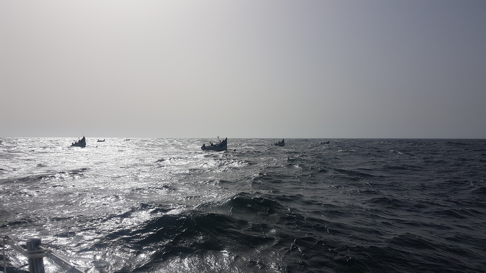

Monday 23rd

Yesterday was Sunday fun-day. The lunch time get together was extended and our TC Sandra along with Sophie produced a host of sweeties and some coke for each of us. We had some nominations for people with the x factor form the week, some funny some serious, everyone was in high spirits by the end. During the night we picked up a mayday from one of the other clipper boats reporting a man over board. Thankfully they reported a successful recovery. This afternoon our lunch was delayed as we said good bye to our spinnaker packed it away and hoisted our white sails for the first time in eight days. Good bye to days of stable winds and fair weather. As we batten down the hatches and prepare for the tail end of the building tropical storm, that is currently being birthed in the middle of our doldrums corridor. The boat is hot and stuffy with humidity. Now we have to get used to life at 45 degrees again for the next 36 hours until we are predicted to loose the wind completely. 

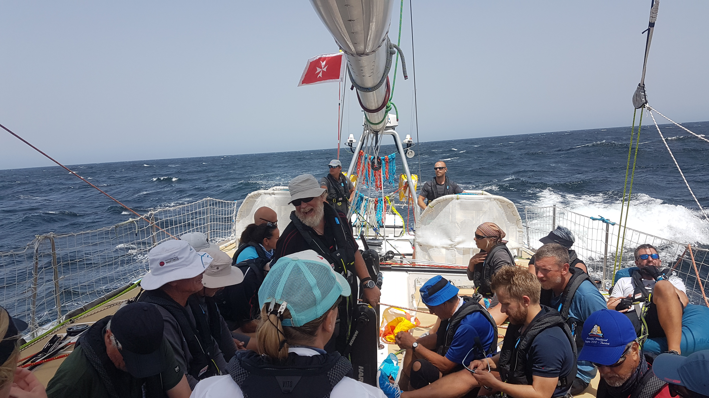

Wednesday 25th 

Over the last 2 days we had a busy series of watches with the wind building during Tuesday. The morning watch was extended as we changed the head sails from the yanky 1 to the yanky 2. This was conducted at watch change over so there were more hands to help make the job quicker. Due to some miss communication the sail was “smoked” (the halyard dumped of the winch and the sail dropped in an uncontrolled manor) rather than having a fast controlled drop, witch meant it was much harder than it should have been to haul the sail back on board.

The 3 till 7 watch was one of the hardest and most intense watches yet. In the space of 4 hours we dropped the yanky 1. Hoisted the yanky 3. Realised the halyard was rapped around the port top spreader, something that could cause serious race ending damage to the rigging and sail. Dropped the sail to put it right, then re-hoisted. Untangled the lazy sheet ,which had tied its self round the active one during the manoeuvrers. Packed the yanky 1. Put in reef 1 on the main sail. Shook out reef 1. By the end we where all exhausted and in need of some rest. Sandra spent virtually all her off watch up lending before being mother for the day. As we have come together as a team me Alex and Sandra have become used to getting up on our off watches to help evolutions run smoothly. This has been draining on each of us. I have been up a few time now to help with various manoeuvrers. During the my morning off watch I got up to help move the yanky 2 off the foredeck after an aborted sail change. Then just as I was about to get into my bunk the gas ran out so I was asked to change the bottle. Nothing is ever easy on the boat especially when its at a 45 deg angle. More so with the gas change. We normally carry four bottles spilt 2 port and 2 starboard in lockers at the stern of the boat. We had been given a fifth bottle in Portomaio which uses a different regulator, so the port gas locker had its regulator changed and that bottle connected, the extra bottle (part empty from race 1) was lashed to the deck behind the helm. So when it came to changing the bottle we wanted to use up the part empty one first, this meant creating space in the starboard locker which has correct regulator. To do this I had to swap the empty bottle with a full one and put the part full one in the space created and connect it and finally lash the empty bottle to the deck. As the day wore on the wind started to die off and we changed the head sails again until the wind seeker was hoisted and we started to bob, now properly in the doldrums. At 630 this morning we turned the engine on and started our 60 hours of motoring. The morning watch has been spent packing away the sails and doing some much needed cleaning. 

Friday 27st

We are now nearing the end of our period of motoring. Its going to be nice to be sailing again and not have the noise of the engine ringing in my ears. The doldrums has provided some much needed rest. Giving a chance to sort out and wash our selves and some kit along with catching up on sleep. The watches drag at times as motoring in a straight line is not the most entertaining of activities. Several games of black gammon have been played along with way to many iterations of 20 questions. The boat has been given a good clean as much to keep us busy as because it needed it. Sails have been checked over, hanks repaired all in preparation for the up wind stage of the leg. Below decks is a furnace with the heat from the engine and the cooker combined with worm seas and hot weather preventing it from ever cooling down.      
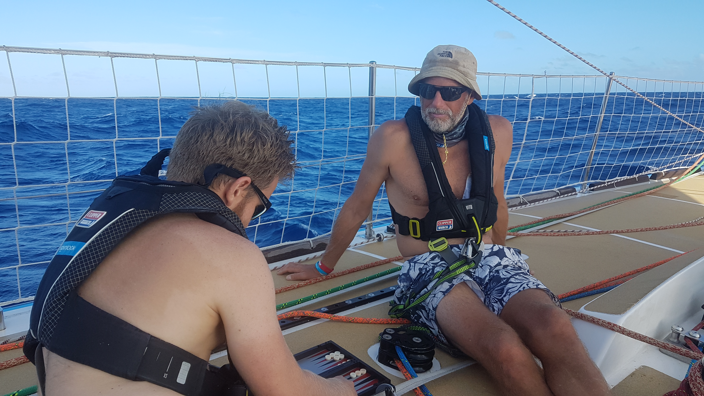

Saturday 28th 

We are sailing again and so far haven't spent to long drifting with no wind. Over night we picked up a nice south west breeze allowing us to start heading south. As the night wore on the wind increased meaning that our average speed is now around 8 knots. This is faster than the boats that are currently under motor preventing then from making to much distance on us from the extra wind they got when entering the corridor. I'm looking forward to a time when I don't wake up soaked in sweet because my fan battery has run out. We are breaking the race up into smaller targets our next the end of the doldrums corridor, then the ocean sprint, then Punta and the finish. 

Tuesday 1st 

After a day of clear sky's and plain sailing we crossed the equator at 2.38 UTC last night. And now enter the southern hemisphere for the rest of this year. Some interesting facts worked out last night. We will cross back in the the northern hemisphere in February 2020 near papa new guinea. Before then we will have sailed around half the world since this crossing approximately 180 deg of longitude.

I have been working hard as a watch leader to make sure that those of my watch that want get a chance at the helm to improve there skills and help lighten the load on those of us that are already competent. The past couple of days have been great for this as we have had a fairly constant wind, virtually no swell and white sails so no fear of damage if we get it wrong. 

Thursday 3rd

We are now in the ocean sprint and had the most active watch for a long wile with a head sail change and taking reefs in and out. Something we are getting much slicker at. As the days at an angle go on people are getting used to climbing around the boat. Last night we had our first fall and this morning our fist injury as one of the crew slipped at the bottom of the companionway  and banged his head. Multiple stitches were required and the galley became a temporary surgery. 
The nights are getting cooler as we head south brining some relief form the heat below decks.

Saturday 5th 

yesterday evening I had my head shaved a little late but as a tribute to Neptune along with the other watch leader Alex. Jokes were flying that we were trying to look more like our skipper Ian in an attempt to gain some of his skills and experience.
after a couple of days of fine reaching under the y1 where we had to keep our eyes open for squalls that brought not only rain but strong bursts of wind for around 20 mins we would have to turn down wind and ease the main to maintain control of of the boat we hoisted the code 3 and got set for some fast paced sailing.

Sunday 6th

Sundays are fun days has become a saying on the boat. This is a slight change to our daily team meeting and give us something to look forward to during the week as it involves extra treats and normally a glass of cold coke as well although there is some trepidation as to what the forced fun activity will be we also get our x factor nominations of the week given by the skipper and mate. They are for the crew that have done something memorable or outstanding, this can range from recognition of going above and beyond in helping out to managing to not be sea sick for the week.

Just to add to the confusion we are changing boat times today as well, we will now be 2h behind UTC.

Wednesday 9th 

I have struggled to find the time to keep this log updated as we have had a couple of busy days and sleeping became more important. So I'm struggling to remember quite what has happened. This morning we woke up for breakfast and got informed that we would be receiving the spinnaker as the wind had died and the wind seeker was being hoisted. This was a little bit of karma as we had pulled a similar thing the morning before. When we dropped the spinnaker on a watch change and the other watch packed it. Last nights graveyard shift was particularly challenging as the wind was gradually dripping and the clouds were providing a uniform grey sky to use as a reference for helming. 

Tuesday 8th

We had a busy couple of watches with sail changes and manoeuvrers, while the other shift got a full 6h of rain. In the morning as I have mentioned we changed from spinnaker to white sails then in the after noon we crossed from one weather system into another with an almost 180 deg wind shift. We had an indication of when the shift was happening as Zhuhai the boat we have been chasing down since Sunday was visible on AIS and we spotted them changing direction and bobbing around as the wind became fluky. During this time we passed a seismic survey vessel towing 7miles of cables we were required to jibe to give them enough clearance. 

With the end now in sight peoples sprites are reviving and the boat has an almost giddy air. It helps that for the first time in a couple of weeks we are constantly closing the miles on the closest boats in  front. 

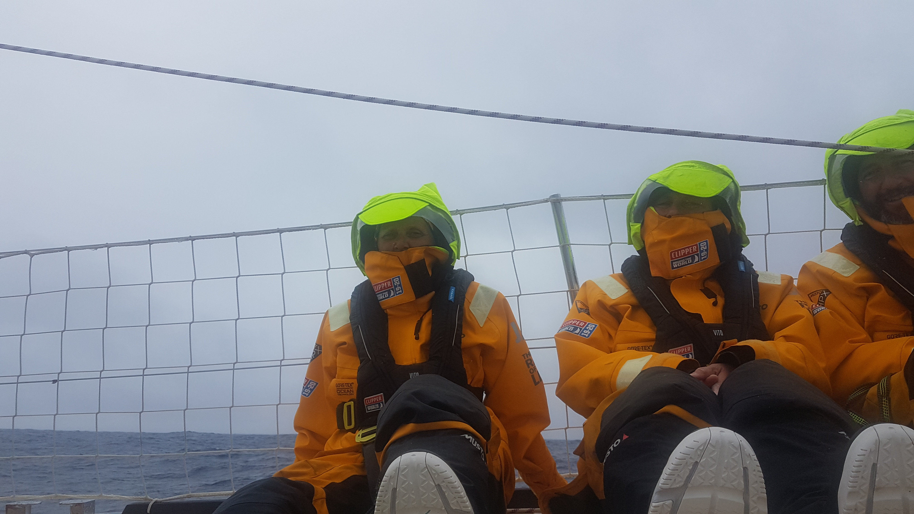

Thursday 9th 

Yesterday we spent some time going in the “wrong direction” to avoid a wind hole and get better breeze. The middle of the fleet is getting closer together with 4th 5th and 6th hotly contested everything is still to play for. We are now back under spinnaker and feeling good at the efficiency of our hoists and drops along with the much less dreaded spinnaker packing.   

Friday 11th 

Last night was a tuff one with the wind building up to 35kn. during the evening change over we had a broach that resulted in Sandra getting whipped by the lazy spinnaker sheet as it was incorrectly set for an emergency drop. Thankfully she has only suffered bruising and was back on her feet following a watch of bed rest. Then in the middle of our off watch the code 2 ripped after a collapse this resulted in us being woken to the call for all hands to get the spinnaker down as quickly as possible. The yanky 1 was hoisted in its place. During our graveyard shift of 11 till 3 the helm was shared between me and Danny as it was so challenging and it was deemed to risky to introduce new helms at that stage, with a ruff sea state and strong winds, at times it to to of us to maintain the heading and prevent a broach. The 4 hours passed quickly with us doing a 30min rotation on the helm. Holly did an amazing job calling out the swell and the key numbers from the instruments meaning that we could focus all our attention on keeping the boat going straight. I think our max speed was 20kn surfing down the swell. During the morning watch the swell died down and the winds as forecast reduced so we hoisted the code 3. Spirits are high as its predicted to be only 2 days until Punta. Several people are looking forward to some shore time and getting their own space again.

Saturday 12th 

We had a hard day of sailing today with the winds being very changeable and big thunder storms rolling through. We started off the sunrise watch with the wind seeker then hoisted the code 1. Part way through the hoist we realised that the starboard halyard was run incorrectly so we had to drop the spinnaker on the the deck while we in tangled the line. Thankfully the wind was light other wise we would have had a much harder time sorting it out. During our afternoon watch we had to drop the spinnaker due to a squall that was coming through. Unfortunately the spinnaker had other ideas it took 4 attempts to get it under control and down below. With 6 of us all hugging the sail to prevent it from reinflating while we hauled it down. At times it threatened to drag us all back up with it. After we finally managed to tame the sail every thing calmed down for a while. Until about 1700 when this massive storm appeared on the horizon heading straight for us. We dropped the yanky before it hit. Then as the wind increased the main sheet was ripped out of my crew mats hand in a 80knot gust. The battle to get the main under control and prevent any major damage to the rigging began, as the team ground the line back in. After about 5 minutes of intense work every thing was back under control. The rain and hail continued unabated. Mike did an incredible job at the helm keeping the boat under control throughout the chaos. 

Sunday 13th 

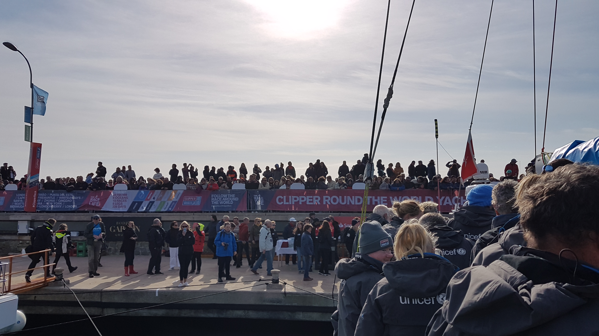
We have arrived!! 

##Photos
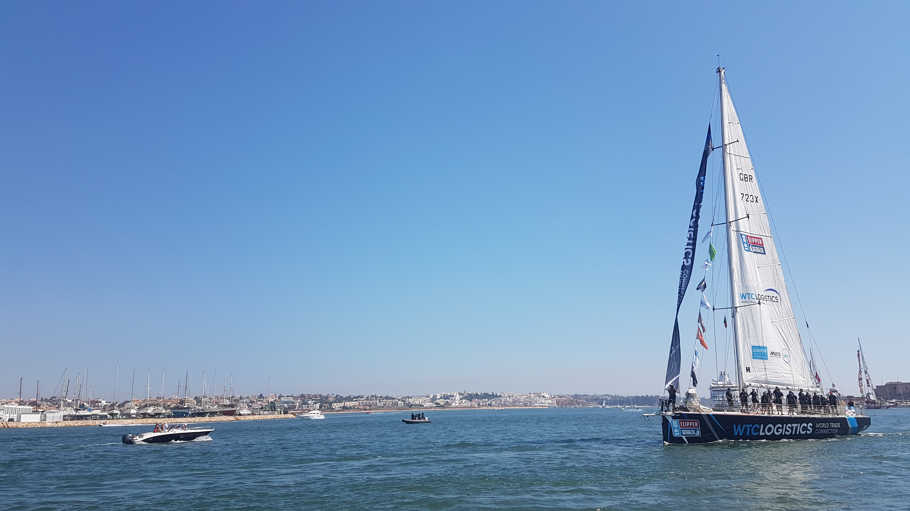
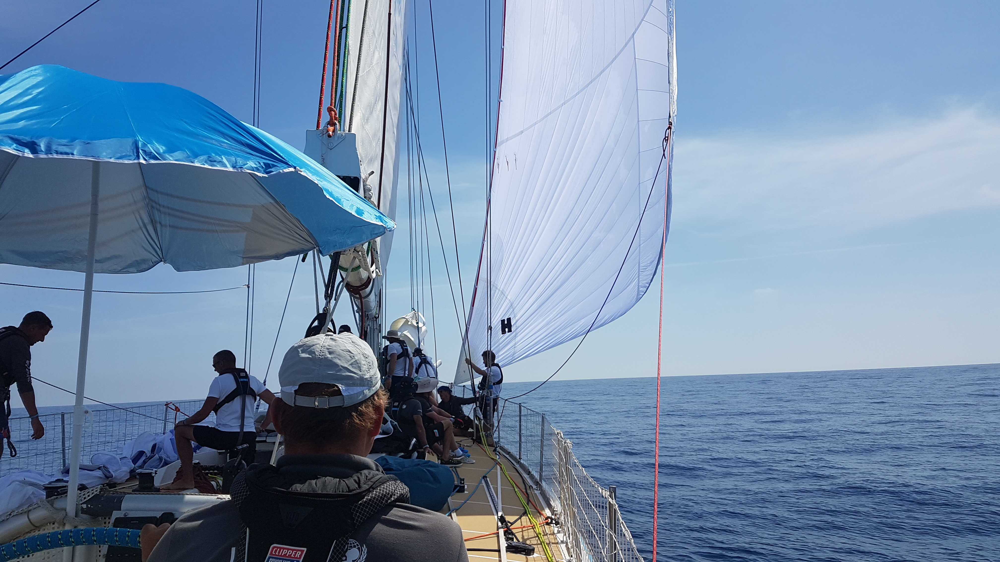
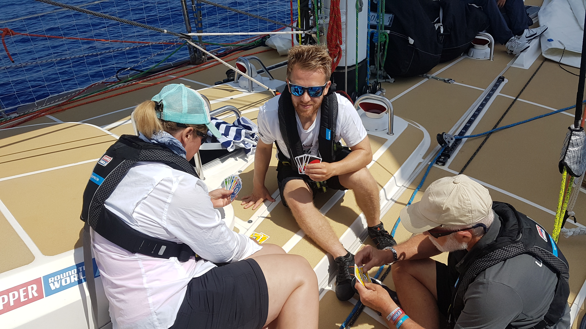
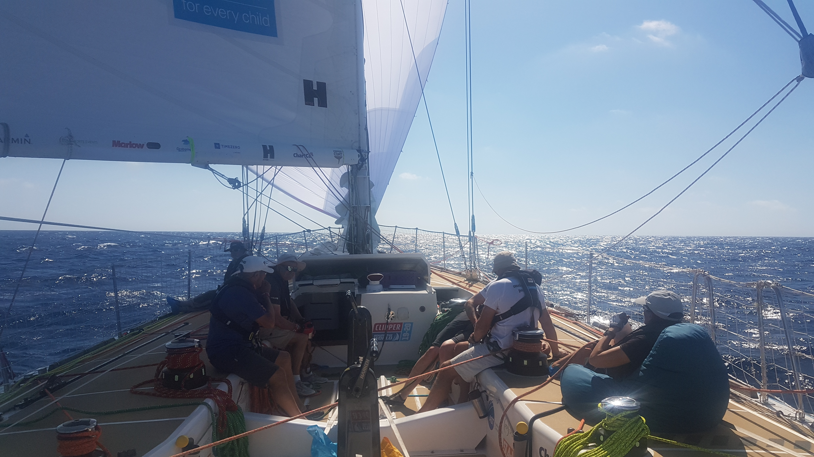
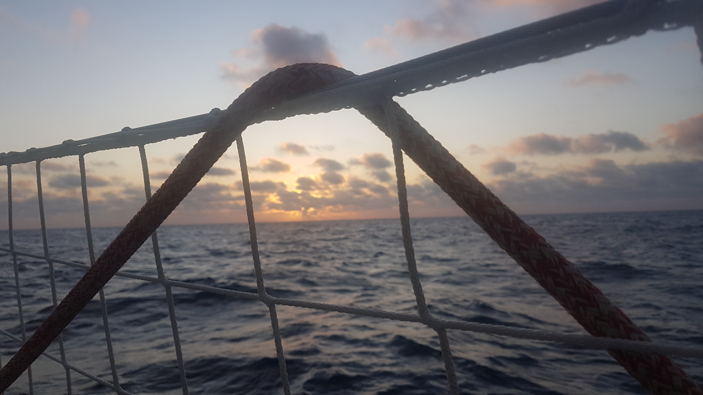
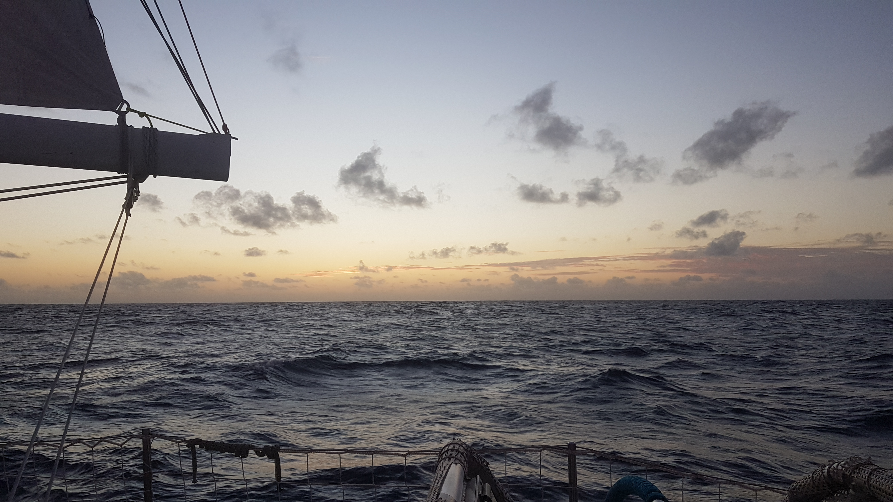
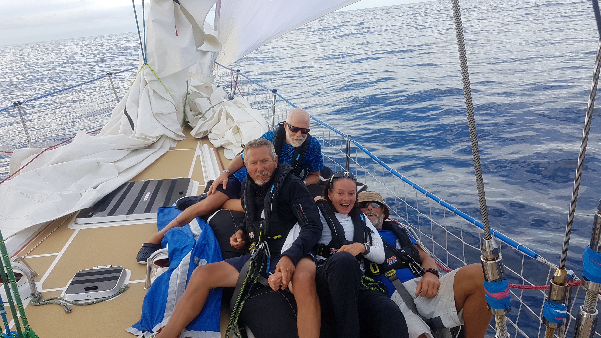

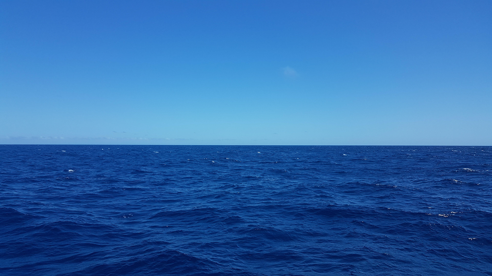
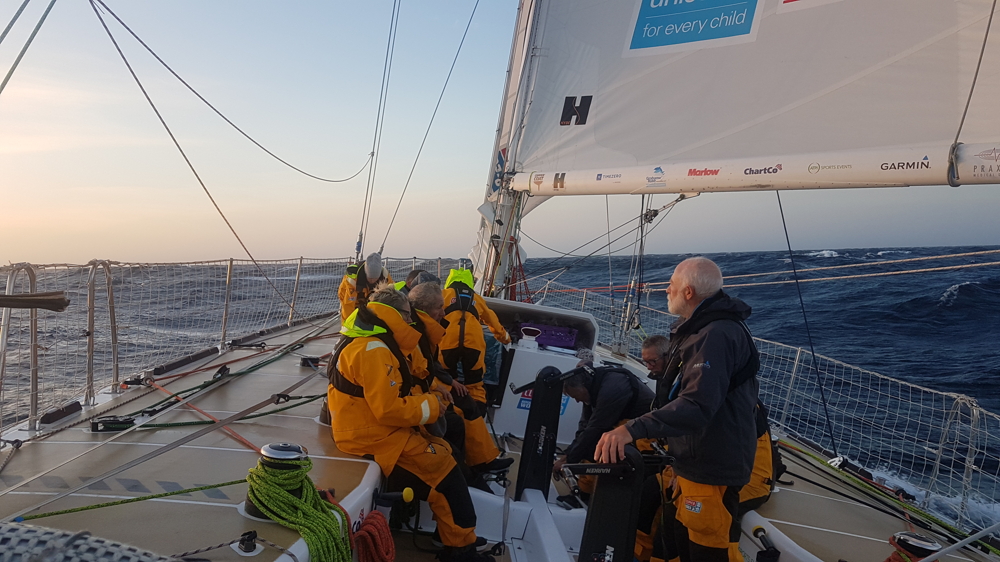
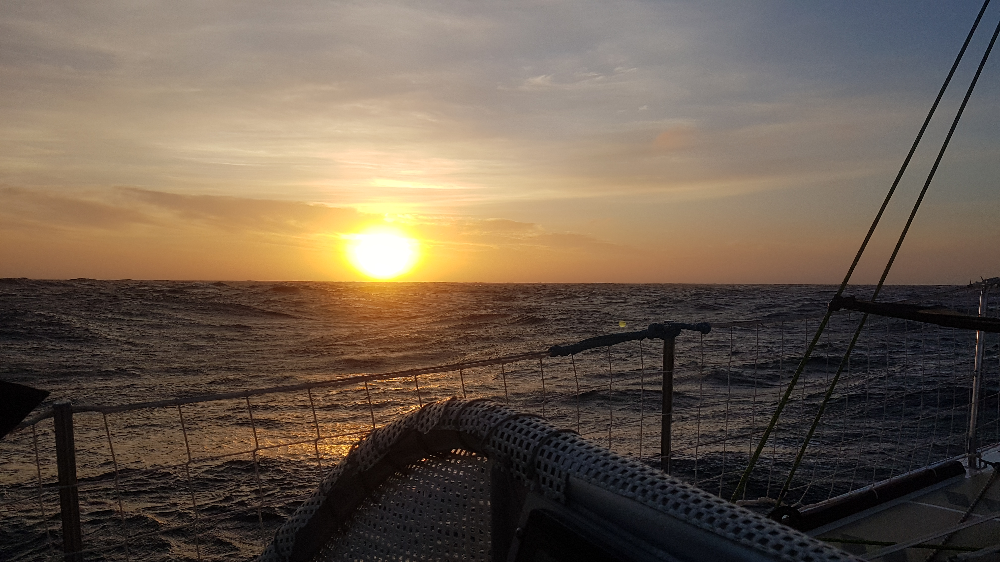

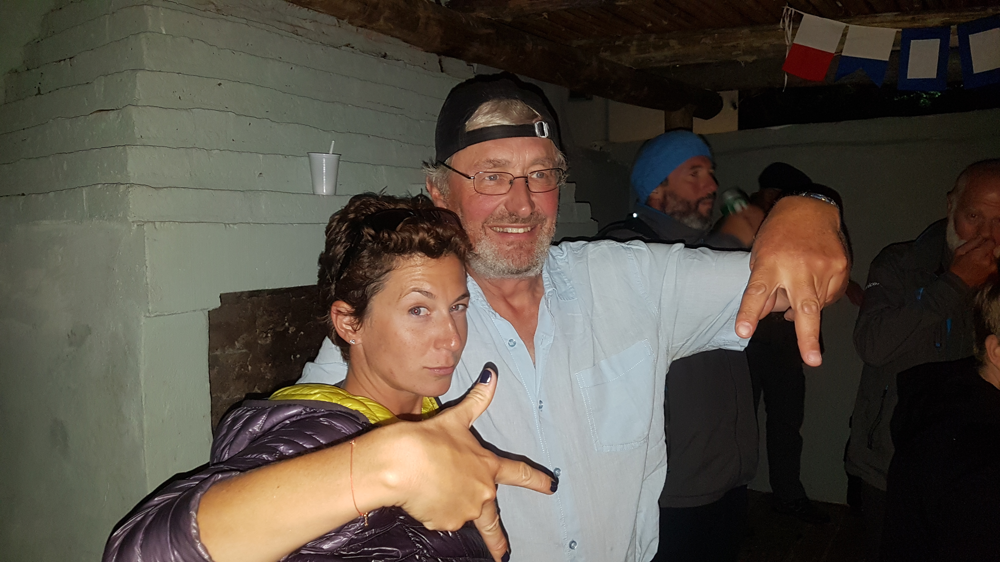
